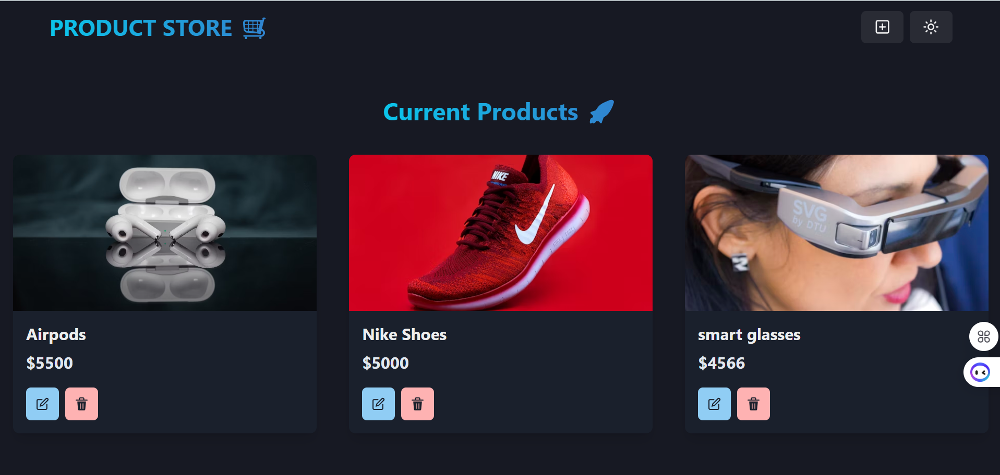
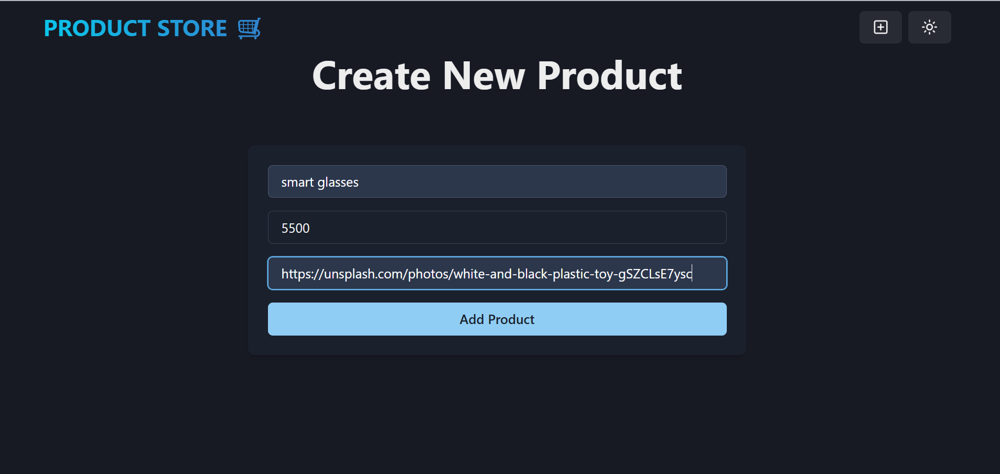
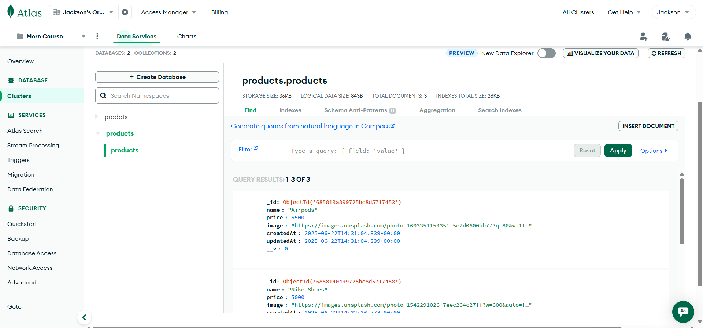

# MERN Stack Product Management App

A full-stack web application built with the MERN stack (MongoDB, Express, React, Node.js) for managing products. The app supports product creation, updating, deletion, and viewing with a modern responsive UI.
---

## Features

- **Product CRUD:** Create, read, update, and delete products with ease.
- **Modern UI:** Built with React and Vite for a fast, interactive experience.
- **RESTful API:** Express.js backend with MongoDB for persistent data storage.
- **Responsive Design:** Works on desktop for now.
- **CORS & Environment Config:** Secure API access and environment variable management.

---

## Screenshots

|** Home Page |** 
|-----------|------
|  |
|-----------|------
**Add Products Section**
  |
|-----------|------
|** Database |** 
 |

---

## Tech Stack

- **Frontend:** React, Vite, JavaScript
- **Backend:** Node.js, Express.js
- **Database:** MongoDB (Atlas)

---

##  Getting Started

### Prerequisites

- Node.js (v18+ recommended)
- npm
- MongoDB Atlas account (or local MongoDB)

